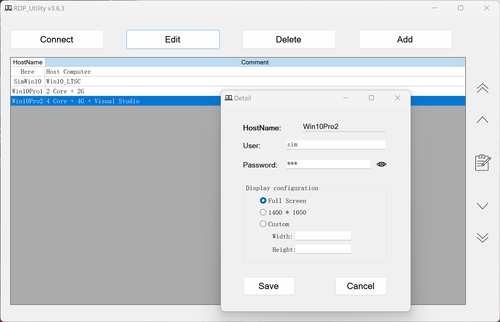

This is a small utility to help with maintaining RDP connections.

The utility is using mstsc.exe to connect to the RDP sessions.

The utility is a portable version, no installation is required, and it is ready to use when unzipped.

